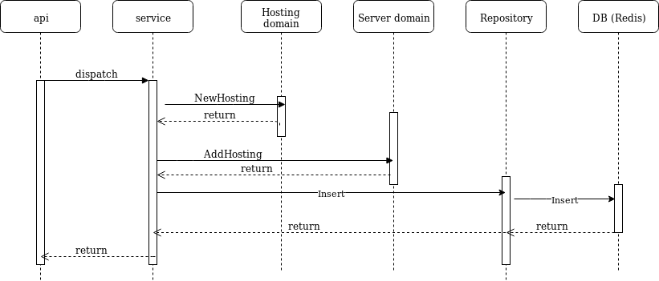

# CDMON coding challenge 2

As it has been required to do, it's a "hostings" REST api which publishes three end points.

## Create a hosting 
**POST /hosting** 
Each hosting has an UUID (ID) field used as primary key. This UUID is assigned automatically when it's created
```json
RQ:
{
	"name": "h2",
	"cores": 1,
	"memorymb":1,
	"diskmb": 1
}
```
```json
RS:
{"uuid":"fcf630c7-2c8a-11e9-8834-0242ac120003"}
```
This end point returns HTTP status 200 if all works fine. Otherwise, it can return the codes:
* 400 if the RQ is a bad JSON
* 409 if already exist a hosting with the same name
* 500 for unknowed errors


## List created hostings
**GET /hosting** 
```json
RS
{
  "Hostings": [
    {
      "uuid": "87a02d1a-2c8c-11e9-b8ed-0242ac120003",
      "name": "h1",
      "cores": 4,
      "memorymb": 2,
      "diskmb": 15
    },
    {
      "uuid": "84990ee5-2c8c-11e9-b8ed-0242ac120003",
      "name": "h2",
      "cores": 2,
      "memorymb": 2,
      "diskmb": 10
    }
  ]
}
```
This end point returns these HTTP status codes:
* 200 if all works fine but there aren't hostings
* 302 if all works fine and there are hosting to be listed
* 500 for unknowed errors

## Remove a hosting
**DELETE /hosting/{UUID}** 
```json
RS
{
    "uuid": "84990ee5-2c8c-11e9-b8ed-0242ac120003"
}
```
If the remove action works well, it resturns a HTTP status 200. Otherwise, this end point can return these HTTP status codes:
* 404 if the hosting to be removed does not exist
* 500 for unknowed errors

## Update a hosting
**PUT /hosting** 
```json
RQ
{
	"uuid": "84990ee5-2c8c-11e9-b8ed-0242ac120003",
	"name": "h2",
	"cores": 6,
	"memorymb":2,
	"diskmb": 10
}
```
```json
RS 
{
    "uuid": "84990ee5-2c8c-11e9-b8ed-0242ac120003"
}
```
If the update operation works fine, it returns HTTP status 200. Otherwise, this end point can returns:
* 400 if the RQ is a bad JSON
* 404 if the hosting to be modified does not exist
* 500 for unknowed errors

## Health 
**GET /healh**
This is an additional end point I've added to make possible to see the estate of the server, as well as the availability state of its resources: Cores, memory and disk
```json
RS
{
    "running_time": "5 seconds 527 milliseconds",
    "ServerStatus": {
        "uuid": "f7f24bfb-2c8a-11e9-8834-0242ac120003",
        "total_cores": 100,
        "total_memory_mb": 100,
        "total_disk_mb": 100,
        "available_cores": 100,
        "available_memory_mb": 100,
        "AvailableSizeOfDiskMb": 100
    }
}
```

## Approach
To code this exercise, I've stablished these rules:
* There is a Server domain wich acts a hostings container. It would also could be taken as an aggregate root. However, I've maintained the two domains (Server, Hosting) as separate domains to make the code simpler. Basically, I use Server domain as a resources container. These resources are cores, memory and disk. Every time that a hosting is created, removed or updated, the server domain update its resources availability. It also ensures that a creation or update operation will not exceed the server resources availability.
* I've assigned an UUID to each entity. In the case of Hosting entity, this new field  has replaced the ID field.
* The hosting attribute "Name" must be unique.
* The hostings are serialized in a binary way to be persisted into Redis. I've done it like that because it has better performance than json serialization
* A feature that would improve the performance of the service in a high concurrency scenery, it would be to implement **CQRS pattern**. I've not implemented here because I haven't had time enough. Also It could be implemented at systems infrastructure level, by using a Redis cluster and different services instances to read and write operations
* Another improvement opportunity is to persist the server state instead of initialize at start up. In that way, several concurrent instances of the server would see the same resources server


## Infrastructure
* Go go1.11.5: As a programming language
* Go mod: I've used modules as dependency management. **NOTE: go mod does not put all dependencies in vendor folder**
* Make: GNU Make 4.2.1
* Redis 5.0: I've used Redis as a storage. It's accessed for the repository layer only
* Docker 18.06.1-ce: Used to build a docker image with the service
* Docker-compose 1.21.0: Used to start the service as a docker container

## Design
I’ve choosen implementing a simple architecture, but good enough to apply the SOLID principles. For example “Single Responsability” and "Interface Segregation". This is the flux between packages for the Insert operation. You can see in it the responsability isolation by component:

 

In this use case, the server domain logic ensures that the server resources (cores, memory, disk) will not be exceeded with the new hosting. This logic also applies for remove, and update operations. 

There are these packages:
* **app/config**: Configuration values
* **app/api**: REST API publising and routing. It depends on *app/service* package.
* **app/service**: Application service. This package provides the needed service logic to resolve the api requests. To do this , it depends on the *app/domain* and *app/repository* packages.
* **app/domain**: Domains of the bounded context for this service. In this case, Server and Hosting. Each of these domains provides its domain logic, for example to validate themselves, or, in the case of the server, to avoid resources overflowing.
* **app/repository**: This package provides a persistence layer abstraction. It depends on *app/store* package.
* **app/store**: Persistence layer implementation. In this case, it's a Redis instance.

Almost all packages includes unit tests. I've implemented it where it makes sense. Basically where the coded logic has a minimum of complexity


## Launch the unit tests
To launch the unit tests, you must do:
```sh
make test
```

## Start the service as a Docker container
The service inludes a Makefile to make easy compile and start it. You can view the Make commands in that way:
```sh
make help
```

The easiest way to start the the service is as a Docker container. Firstly it's necessary build the container:
```sh
make docker-build
```
When it finishes, the service container can be started:
```
❯ make docker-run
>>> Running Docker image ...
docker-compose up cdmon2
cdmon2_redis_1 is up-to-date
Starting cdmon2_cdmon2_1 ... done
Attaching to cdmon2_cdmon2_1
cdmon2_1  | >>> Running ...
cdmon2_1  | go run main.go
cdmon2_1  | time="2019-02-09T17:45:57Z" level=info ....
cdmon2_1  | time="2019-02-09T17:45:57Z" level=info msg="starting hosting service at port 8080"

```

## Start the service without Docker
You also can start the service without Docker. To do this you'll need to have an accessible and running Redis instance. In addition, you'll have to ensure that the environment variables are correctly informed in the file *setenv.sh*. These are the default values,
```
#!/bin/bash

export CDMON2_API_PORT=8080
export CDMON2_TOTAL_NUMBER_OF_CORES=100
export CDMON2_TOTAL_SIZE_OF_MEMORY=100
export CDMON2_TOTAL_SIZE_OF_DISK=100
export CDMON2_MINIMAL_NUMBER_OF_CORES=1
export CDMON2_MINIMAL_SIZE_OF_MEMORY=1
export CDMON2_MININAML_SIZE_OF_DISK=1
export CDMON2_REDIS_ADDR=localhost:6379
```
The *minimal* variables refers to the allowd minimal value for each of these properties to the new hostings.

Done this, you're are ready to compile and start the service
* Compilation: 
```sh
make build
```
* Starting:
```sh
make run
```
